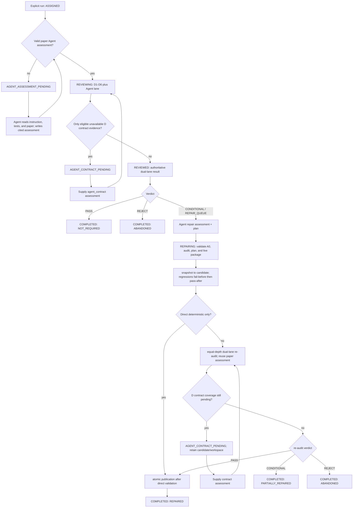

# Materials Repair Redesign Handoff

## Objective

Bring `materials-benchmark-repair` to the intended material-science version of
the Repair workflow.  Repair must accept both deterministic and Agent-reviewed
findings, allow an Agent to read the audited package and author evidence-bound
changes, fast-publish narrow deterministic repairs after their regression
suite passes, and retain the canonical human-readable repair bundle layout.

This is an implementation plan, not an approval to weaken the scientific
boundaries.  A repair must never invent a target, Gold, tolerance, formula,
unit, scientific parameter, material structure, trajectory, or result.

## Non-negotiable Repository Constraints

- The Harbor package remains free of generated audit and repair artifacts.
  The requested `benchmark_repair/` layout is therefore emitted at
  `.review_records/<cluster>/<theme>/<paper>/runs/<run-id>/repair/benchmark_repair/`,
  not inside `paper-*/`.  This preserves `AGENTS.md` while using the requested
  bundle name and contents.
- `paper/**`, package metadata, and `environment/**` remain read-only unless a
  later, explicit policy change expands that boundary.
- Review remains read-only.  Repair alone may atomically replace the package.
- A source audit is immutable and bound to the run A0 ContentRoot.  Every
  publication path rechecks the source audit digest and package identity.
- No plan may use `solution/**`, Oracle output, or hidden answer content as
  evidence for public instructions, checker semantics, or science changes.

## Target Lifecycle

```text
ASSIGNED -> validated paper Agent assessment -> Review (D1-D6 plus Agent-quality/A findings)
  -> frozen source audit + complete OPEN repair queue
  -> Agent repair assessment and batch plan
  -> isolated snapshot/candidate execution
  -> direct deterministic publication OR equal-depth re-audit
  -> run-local benchmark_repair bundle + immutable history
```

## Lifecycle Guardrails Imported from `PLAN (2).md`

The following guardrails are part of this redesign.  They apply before and
through Repair, not only after a Review report exists.



### Mandatory pre-Review Agent assessment

Add `AGENT_ASSESSMENT_PENDING` as a distinct run state.  For every task other
than an Agent-authoritative `NON_MAT` fast rejection, Review may not run D1-D6,
write/freeze A0, create a formal audit bundle, set `REVIEWED`, enter Repair, or
be finalized into corpus tracking until `agent_assessment.json` validates.

The required assessment is paper-grounded and contains the Stage 0 taxonomy
decision plus A2/A4/A5 analysis, exact citations to package files and paper
files, source hashes, and schema-valid labels.  Once supplied, the same run
resumes at `REVIEWING`; it does not create a new assignment or discard existing
non-authoritative diagnostics.  `AGENT_CONTRACT_PENDING` stays separate and is
permitted only after this full paper Agent lane has validated, solely for the
narrow D1-D6 unavailable-contract overlay.

### Source-audit eligibility and assessment inheritance

Repair must accept only a complete, dual-lane `REVIEWED` source audit that
binds a valid paper Agent assessment.  A legacy/incomplete audit with
`NOT_SUPPLIED` assessment is migrated to `AGENT_ASSESSMENT_PENDING` rather
than repaired.  The migration is idempotent, preserves existing diagnostics,
does not update tracking, and has an explicit inventory/fixture for the
currently known ten affected runs.

Every re-audit-required candidate must receive the exact, already validated
paper assessment through the restricted internal Review context.  The internal
Review API must make this input required, not an optional path that silently
falls back to deterministic-only Review.  If it is absent, invalid, stale, or
does not bind the candidate's permitted changes, pause as the appropriate
assessment-pending state before mutation/publication and do not consume a
semantic attempt.

The `PLAN (2).md` flow called for re-audit after every candidate.  This handoff
adopts its guardrails for all non-deterministic repairs, while applying the
user-requested direct-publication exception only to the tightly defined
`DIRECT_DETERMINISTIC` route in section 4.  That exception never bypasses the
pre-Review paper assessment, source-audit eligibility, or atomic validation.

### 1. Review produces a repairable queue from both lanes

1. Keep D1-D6 as machine-owned checks and preserve their exact check status,
   evidence, and source binding.
2. Make repairable Agent-quality findings first-class queue entries instead of
   residual, permanently non-repairable evidence.  The queue must include
   findings from `agent_quality/assessment.json` and the source report's A
   lane, with stable `finding_id`, severity, C01-C07 ownership, repairability,
   evidence references, and `lane: agent_quality`.
3. Agent-quality findings must not be assigned a fabricated D1-D6 check.  Add
   `repair_lane` / `repair_scope` fields rather than overloading
   `deterministic_check`; allowed values should distinguish at least
   `DETERMINISTIC_WIRING`, `CHECKER_ROBUSTNESS`, `INSTRUCTION_CONTRACT`,
   `SCORING_SEMANTICS`, `DIRECT_INPUT_REFERENCE`, and `SCIENCE_SEMANTICS`.
4. Review's finalization must route an OPEN repairable Agent finding to
   `REPAIR_QUEUE` even when D1-D6 is `CLEAN`.  Hard Gates, unrepairable Agent
   findings, and evidence gaps retain their existing non-Repair routes.
5. Extend `agent_quality/assessment.json` and the source audit report schema
   with a normalized `repair_findings` list.  It is produced by the Review
   Agent, then validated by the CLI for taxonomy, exact citations, source hash,
   package path safety, C-dimension mapping, and deterministic finding IDs.

### 2. Required Agent repair assessment

Create `repair/agent_repair_assessment.json` before any candidate mutation.
This is an Agent-authored, CLI-validated artifact, not a human-approval state.
The Agent must read `instruction.md`, applicable `tests/**`, source audit
evidence, and `paper/**` whenever the finding is scientific or paper-grounded.

The assessment contains one record for every OPEN queue finding:

```json
{
  "schema_version": "materials-agent-repair-assessment/1.0",
  "audit_id": "...",
  "a0_content_root": "sha256:...",
  "package_identity": {"directory_name": "paper-..."},
  "findings": [
    {
      "finding_id": "...",
      "lane": "deterministic_core | agent_quality",
      "decision": "AUTO_FIX | ASSISTED_FIX | ABANDON",
      "agent_verdict": "APPROVE_REPAIR | BLOCKED_EVIDENCE | ABANDON",
      "repair_scope": "...",
      "core_science_change": false,
      "rationale": "...",
      "evidence": [{"source_kind": "...", "exact_quote": "...", "source_hash": "sha256:..."}],
      "approved_operation_ids": ["op-..."]
    }
  ]
}
```

Validation rules:

- The assessment binds the full source queue; omission is a fail-closed error.
- An Agent can classify and repair D1-D6 findings after reading the package.
  The machine check remains factual authority: an Agent cannot suppress a
  machine `FAIL`, delete a confirmed finding, or turn unavailable evidence into
  a scientific claim.
- `AUTO_FIX` remains only a unique, source-bound deterministic restoration.
  The assessment records why the operation is unique; it cannot broaden the
  current AUTO_FIX policy.
- `ASSISTED_FIX` is available for both D findings and Agent findings.  Every
  operation must be explicitly approved by the assessment and backed by
  type-matched evidence.  `BLOCKED_EVIDENCE` and `ABANDON` make no mutation.
- Agent-reviewed checker changes may fix proven fairness defects (for example
  non-finite bypasses, duplicate-counting, direction inversion, order
  sensitivity, missing output enforcement, ineffective reward linkage, or a
  demonstrated gaming submission) only when the intended contract is proven
  from allowed evidence.  Otherwise the finding is abandoned or blocked.

### 3. Plan schema and Repair input changes

Replace the D-only plan assumption with a new schema, for example
`materials-repair-plan/2.0`; retain the previous 1.0 schema as read-only
history evidence, not as an executable input.

The batch plan must bind:

- audit ID, source audit bundle digest, A0 ContentRoot, package identity, and
  Review implementation digest;
- the complete open queue across `deterministic_core` and `agent_quality`;
- the hash and schema of `agent_repair_assessment.json`;
- each finding's lane, scope, decision, evidence IDs, operations, regression
  IDs, and publication route;
- a declared `publication_class` per operation: `DIRECT_DETERMINISTIC` or
  `REAUDIT_REQUIRED`.

Change `run_repair.py` validation so a finding is resolved against the
canonical source report, not only `deterministic_contract.required_finding_ids`.
Continue to require that all OPEN repairable queue entries are addressed in
one batch.  Do not permit a plan to silently skip Agent findings.

### 4. Isolated execution and publication routes

All changes are still applied only to run-local `snapshot/` and `candidate/`.
Every operation must have a causal regression that fails on `snapshot` and
passes on `candidate`; command regressions remain in `qa-checker`.

#### Direct deterministic publication

The user's requested fast path applies only when every operation is
`DIRECT_DETERMINISTIC` and all of the following are true:

- all affected findings are D1-D6 machine findings;
- all are `AUTO_FIX`, `core_science_change=false`, and have unique source-bound
  restoration proof;
- changed files are within the current narrow mutation allowlist;
- all fail-before/pass-after regressions pass, candidate parsing/schema checks
  pass, mutation-boundary checks pass, and the source audit remains unchanged;
- no Agent-quality finding, checker robustness/semantics finding, direct-input
  repair, or paper-grounded instruction change is addressed by the candidate.

Then Repair may atomically publish the candidate immediately, without the
equal-depth Review re-audit.  It records `verification_mode:
DIRECT_DETERMINISTIC` and the exact regression evidence.  This is the only
meaning of “deterministic checks pass then write back”; it is not permission to
publish a checker or scientific semantic change merely because a local test
passes.

#### Re-audit-required publication

Run exactly one equal-depth Review re-audit when any operation is
`ASSISTED_FIX`, targets an Agent finding, changes checker behavior beyond
unique wiring, changes a public instruction using paper/direct-source evidence,
or repairs an indispensable direct input reference.  The re-audit remains the
sole authority for those candidates and must reach `PASS`, score >=80, CLEAN,
no Hard Gate, and no unresolved HIGH/FATAL or queue finding before publication.

Keep the two completed semantic re-audit attempt limit.  Direct deterministic
publication does not consume that re-audit attempt budget; control failures do
not consume either budget.

### 5. Canonical repair bundle and history

Write exactly this public repair bundle at the run-local repair output path:

```text
repair/benchmark_repair/
├── repair_summary.md
├── repair_report.json
├── repair_plan.md
├── repair_plan.json
├── changes.jsonl
├── unresolved_findings.jsonl
├── regression_tests.json
├── re_audit_comparison.json
├── patches/
├── evidence/
├── logs/
└── repair_manifest.json
```

- `repair_summary.md`: human-readable status, decision table, scope,
  verification mode, score delta if re-audited, and publication outcome.
- `repair_report.json`: complete machine-readable terminal result.
- `repair_plan.md` and `repair_plan.json`: before-mutation batch plan and its
  assessment binding.
- `changes.jsonl`: one applied operation per line, with pre/post hashes.
- `unresolved_findings.jsonl`: one retained/abandoned/blocked finding per line.
- `regression_tests.json`: fail-before/pass-after and sandbox provenance.
- `re_audit_comparison.json`: source/re-audit score, verdict, Hard Gates,
  severity counts, resource/checker results, queue resolution, and new finding
  comparison.  For `DIRECT_DETERMINISTIC`, use the same schema with
  `reaudit_performed: false` and an explicit reason.
- `patches/`: unified patches for applied operations and, when no mutation is
  allowed, suggested patches marked non-applied.
- `evidence/`: normalized evidence records plus immutable copies/references
  permitted by path policy; `logs/`: execution and sandbox logs.
- `repair_manifest.json`: schema versions, hashes for every bundle member,
  A0/source-audit/assessment bindings, publication record, and history link.

Archive every terminal attempt under:

```text
repair/benchmark_repair_history/<repair_id>/
```

The existing private `snapshot/`, `candidate/`, and re-audit bundle remain in
the history as needed for provenance.  Replace the old fixed names in
`canonical_status.REPAIR_BUNDLE_FILES`, `write_history_bundle`,
`write_repair_reports`, and their test fixtures; do not emit the legacy
`changes.json`, `patch.json`, `repair.log`, or `history.json` as canonical
deliverables.

## Implementation Work Breakdown

### Review skill changes

1. Add the `ASSIGNED -> AGENT_ASSESSMENT_PENDING -> REVIEWING -> REVIEWED`
   lifecycle to `run_context.py`, `run_review.py`, `prepare_audit_output.py`,
   batch finalization, and tests.  Enforce that an invalid/missing paper Agent
   assessment yields no A0, no formal audit, no Repair route, and no tracking
   update; add the idempotent migration for affected legacy pending runs.
2. Make the restricted internal Review API require a validated paper assessment
   for an equal-depth re-audit.  The public interface remains `--run-dir`.
   Remove any optional-path fallback that could produce a deterministic-only
   candidate re-audit.
3. Update `SKILL.md`, `references/checks-and-stages.md`, and
   `references/scoring-rubric.md` to explain repairable Agent findings, the
   `agent_repair_assessment` handoff, and which findings require re-audit.
4. Add normalized repair fields and schema validation in `artifact_schema.py`,
   `audit_package.py`, `run_review.py`, and finalization code.
5. Update scoring/routing so repairable Agent findings route to Repair and are
   included in the complete queue while retaining lane separation from D1-D6.
6. Preserve `AGENT_CONTRACT_PENDING` as its narrow unavailable-machine-contract
   mechanism; it must not become a replacement for the new repair assessment.
7. Extend Review implementation-file manifest and test fixtures after code
   changes.

### Repair skill changes

1. Reject a source audit unless it is a complete dual-lane `REVIEWED` result
   with a valid, source-bound paper Agent assessment.  Copy/bind that
   assessment into the Repair context without allowing plan fields to replace
   it.
2. Update `SKILL.md` and `references/repair-protocol.md` to publish the target
   lifecycle and direct-vs-reaudit decision matrix.
3. Add the agent-repair-assessment schema, request/template generation,
   validation, full-queue binding, and operation approval checks.
4. Refactor D-only plan binding and `enforce_repair_lane_boundary` into
   lane-aware policy validation.  Preserve strict evidence and no-leak rules.
5. Add the direct deterministic publisher, with an explicit preflight and
   atomic replacement/rollback behavior independent of re-audit code.
6. Retain equal-depth re-audit for all other cases; require the inherited paper
   assessment and update comparison output to
   include the fields specified above.
7. Replace legacy report/history writers with the requested directory layout,
   JSONL files, patch/evidence/log directories, manifest hashes, and terminal
   archive layout.
8. Update run-context helpers and `.gitignore` only if the new run-local
   directories need explicit exclusion; do not change corpus tracking until a
   real run reaches terminal state.

## Test and Acceptance Matrix

Add or revise tests before enabling the new schema in production:

1. Review emits a repairable Agent checker-fairness finding with exact
   citations and routes it to `REPAIR_QUEUE` even when D1-D6 is CLEAN.
2. Repair refuses a plan that omits an OPEN Agent finding, lacks the Agent
   assessment, has stale assessment/source hashes, or uses an unapproved
   operation.
3. An Agent-reviewed D finding can receive `ASSISTED_FIX` after reading the
   package and binding precise evidence; unsupported scientific changes fail as
   `BLOCKED_EVIDENCE` or `ABANDON`.
4. A D-only unique AUTO_FIX passes fail-before/pass-after and publishes through
   `DIRECT_DETERMINISTIC`, with no Review re-audit invocation.
5. Any `ASSISTED_FIX`, Agent finding, checker robustness fix, or
   paper-grounded instruction change invokes exactly one equal-depth re-audit;
   a local regression pass alone cannot publish it.
6. Direct publication fails closed on stale source audit, package identity
   change, mutation outside the allowlist, failed regression, malformed plan,
   or failed atomic swap; original package is preserved.
7. Re-audit publication preserves the existing PASS/80/CLEAN/Hard-Gate/severity
   conditions and two-attempt behavior.
8. A terminal direct, partial, abandoned, rollback, and re-audited repaired
   attempt each has the requested bundle tree; all JSONL and manifest hashes
   validate; histories are at `repair/benchmark_repair_history/<repair_id>/`.
9. No generated repair artifact occurs under a Harbor package; this must be
   asserted in every integration test.
10. A Review without paper Agent assessment remains
    `AGENT_ASSESSMENT_PENDING` and has no A0/formal audit; after supplying it,
    the same run completes dual-lane Review.  Batch finalization cannot record
    either pending state.
11. Repair rejects a source audit that lacks a validated paper assessment, and
    its re-audit cannot run without inheriting that assessment.  Exercise the
    legacy migration fixture and verify it preserves diagnostics/tracking.
12. Run the focused suites, then the full materials review/repair suite:

```bash
python -m unittest \
  tests.test_materials_batch_repair \
  tests.test_materials_safe_repair \
  tests.test_materials_assisted_repair \
  tests.test_materials_benchmark_review_core \
  tests.test_materials_benchmark_review_dual_lane
```

## Delivery Sequence

1. Land the pre-Review assessment guard, pending-state migration, and required
   internal re-audit assessment inheritance with fixtures/tests.
2. Land shared schemas and Review repair-queue changes with fixtures/tests.
3. Land Repair assessment and lane-aware plan validation, still requiring
   re-audit for all executable candidates.
4. Land direct deterministic publication plus negative tests.
5. Migrate canonical bundle/history writers and update all tests and docs in
   the same change.
6. Run an assigned package only after the full suite passes; inspect the
   external run bundle and confirm the Harbor package contains source changes
   only.
